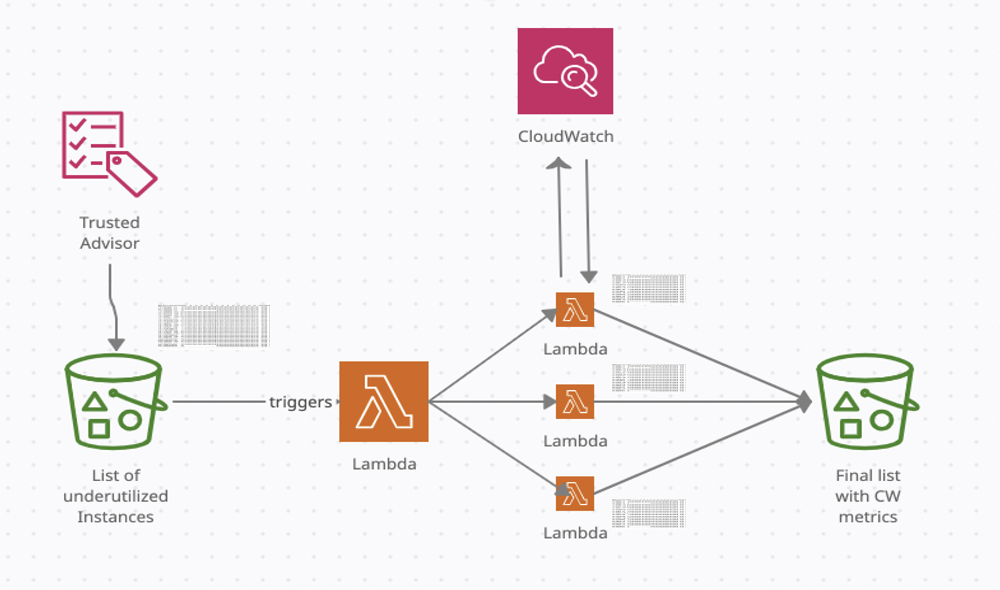

To generate "Low utilization Amazon EC2 instances" recommendations, AWS Trusted Advisor currently checks the Amazon Elastic Compute Cloud (Amazon EC2) instances that were running at any time during the last 14 days and alerts if the daily CPU utilization was 10% or less and network I/O was 5 MB or less on 4 or more days. For some customers, due to their use case, a need may arise to look at the other cloudwatch metrics like Disk I/O and Disk R/W bytes for a more detailed analysis.

https://aws.amazon.com/premiumsupport/technology/trusted-advisor/best-practice-checklist

This tool provides an easy and automated way to fetch cloudwatch metrics for a list of EC2 instances. When the source file with a list of EC2 instances is uploaded to S3 (under a particular prefix), a lambda function TAsplit.py gets triggered. This lambda splits the main csv file into chunks (one file per instance) and then uploads them to S3 (another prefix). Each file upload triggers another lambda TAfetch.py of its own, which then fetches the Cloudwatch metrics and uploads to S3 (processed folder). The purpose of splitting the file is to enable parallelism and keep the execution time < 15 mins.

This tool currently fetches all supported CloudWatch metrics for EC2 instances and its attached EBS volumes. The list and the date range (default 15 days) can be further customized depending on the use case. Please read below link before making any changes 

https://docs.aws.amazon.com/AWSEC2/latest/UserGuide/viewing_metrics_with_cloudwatch.html

**Input and Output files:**
You can use a list of EC2 instance IDs as an input file. As an output, a separate file per instance with selected cloudwatch metrics is returned and uploaded to S3 bucket. Please refer to sample input and output file. 

**Configuration Steps:**
1. Create a S3 folder trustedadvisorfile/ in any S3 bucket. You will later upload your input file in this folder. 

2. Create first lambda functions TAsplit (in the same region) using Python 3.8 as runtime. Configure the above S3 bucket as trigger, use Prefix as trustedadvisorfile/ and Suffix as ".csv" to this lambda. This lambda function will split the input file into chunks and upload them to split folder.

3. Create second lambda function TAfetch wih Python 3.8 runtime. Add the same S3 bucket as a trigger but with prefix with split/ and suffix as .csv. You can optionally add a Amazon SNS topic as output to get notifications. Please ensure your lambda execution role has (at-least) IAM permissions access for S3 bucket ("s3:PutObject", "s3:GetObject" ), CloudWatch ("cloudwatch:GetMetricStatistics") and EC2 ("ec2:DescribeInstances"). Set the lambda execution time set to higher value or to max (15 minutes).

4. Refresh and Download "Low utilization Amazon EC2 instances" list from https://console.aws.amazon.com/trustedadvisor/home?region=us-west-2#/category/cost-optimizing or, create your own list of EC2 instances IDs. Clean everything except two columns Region/AZ and Instance ID and save it in the CSV format (see sample input file)

5. Once file is uploaded to trustedadvisorfile/ folder, lambdas will execute and store output to "processed" folder in the same S3 bucket.

**Constraints:**
While further enhancements are underway, the current solution is limited to AWS account.

